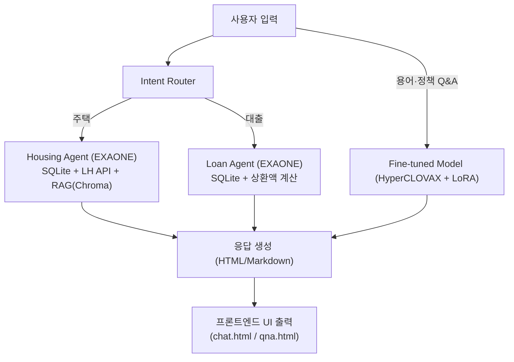
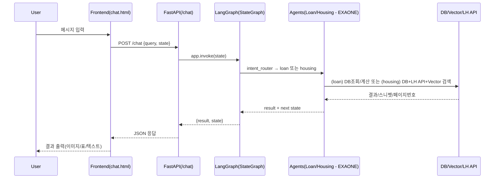

# 🏡 WELHOME: AI 기반 LH 청약·대출 추천 챗봇 (**Fine‑tuning + Agent + LangGraph**)

> **Fine‑tuning + Agent + LangGraph** 조합으로, LH 청약(임대)과 대출 상담을 **단일 대화 흐름**에서 처리하는 실무형 프로젝트입니다.  
> 에이전트 LLM(주택/대출)은 **EXAONE 3.5 (exaone3.5:7.8b)**, 용어/정책 Q&A는 **HyperCLOVAX‑SEED‑1.5B + LoRA**, 검색은 **Vector DB(Chroma)** 를 사용합니다.

---

## ✨ 핵심 가치
- **Agent 지향 설계**: 역할이 분리된 Agent가 **명시적 상태**로 협업하여 사용자 여정을 완결
- **LangGraph(StateGraph)**: 대화 분기/재시작/종료를 **그래프 구조**로 선언해 디버깅·테스트 용이
- **Fine‑tuning(LoRA)**: 정책·용어 Q&A의 응답 일관성과 정확도를 강화
- **RAG(Vector DB)**: 공고 PDF **근거 스니펫**을 주입해 신뢰 가능한 답변 제공
- **단일 엔드포인트**: `/chat` 하나로 Intent→Agent 분기부터 PDF 페이지 이미지 내비까지 처리

---

## 🚀 주요 기능
- **Intent Router**: 입력을 `housing(청약)` / `loan(대출)` 로 자동 분류 (한 단어 응답 유도)
- **Housing Agent (EXAONE)**: 자격 수집 → **임대유형 추천** → **LH 공고 필터** → 선택 공고 **RAG**
- **Loan Agent (EXAONE)**: 금액/기간 입력 → SQLite 조회 → 상환유형별 **총 상환비용** 표/요약
- **PDF 페이지 네비게이션**: “페이지 N” 입력 시 `static/{PAN_ID}.pdf` **N쪽 PNG** 렌더
- **별도 Q&A**: `/qna` 는 **HyperCLOVAX + LoRA** 기반 **용어/정책** 질의응답

> **요구사항 반영 — 임대 조건 UX**: 주택 추천 후 **공고 선택** → 사용자가 *“임대 조건(보증금/임대료/자격…)?“* 을 물으면  
> **텍스트 응답 + 해당 내용이 실린 PDF 페이지 이미지**를 **동시에** 제공 (페이지 이동 버튼·“페이지 N” 점프 포함).

---

## 📊 아키텍처 다이어그램


### 요청–응답 시퀀스(요약)


---

## 📂 프로젝트 구조
```
WELHOME/
├── agents/                 # 에이전트 (EXAONE 기반)
│   ├── housing_agent.py
│   ├── loan_agent.py
│   └── intent_router.py
├── api/
│   └── lh_api.py           # 공공데이터 포털(LH 오픈 API)
├── fine/
│   ├── fine_tuning.py      # LoRA 학습
│   ├── model.py            # 병합/추론 유틸
│   ├── naver.py            # merge_and_unload
│   └── fine_data.json      # 도메인 데이터
├── graph/
│   └── main_graph.py       # LangGraph(StateGraph)
├── utils/
│   ├── db_access.py        # SQLite 질의
│   ├── loan_calculator.py  # 총상환비용 계산/표
│   ├── query_builder.py    # WHERE 빌더
│   ├── region_map.py       # 지역코드 매핑
│   └── vectordb_search.py  # Chroma 검색
├── templates/              # UI
│   ├── index.html          # 메인 페이지
│   ├── chat.html           # 주택,대출 페이지
│   └── qna.html            # LoRA Q&A
├── scss/
│   ├── style.scss
│   ├── _common.scss
│   └── _reset.scss
├── static/                 # PNG/PDF 등 정적자원
│   └── pages/              # PDF→PNG 결과(페이지별)
├── main.py                 # FastAPI 진입점
└── README.md
```

---

## 🧠 LangGraph 설계
- **노드**: `intent_router`, `loan_agent`, `housing_agent`
- **엣지**: `intent_router → {loan_agent | housing_agent}` (조건부), 각 Agent는 `"new"` 입력 시 **자기 재호출**, 그 외 **END**
- **State 예시**
  - 공통: `query`, `intent`, `result`
  - 대출: `loan_amount`, `loan_year`, `loan_table_text`, `loan_history` …
  - 주택: `housing_user_data`, `housing_history`, `housing_notices`, `notice_id`, `pages`, `current_page` …

---

## 🧪 Fine‑tuning (LoRA) — HyperCLOVAX‑SEED‑1.5B
> 목적: **정책·용어**와 같은 안정된 지식을 **정확**하게 답하도록 미세조정

### 1) 데이터 포맷
- 파일: `fine/fine_data.json`
- 스키마(예시)
```json
[
  {
    "instruction": "공공임대주택 신청 자격을 요약해줘",
    "input": "",
    "output": "무주택 세대주이며 소득/자산 기준 충족 등 핵심 요건을 간략히 요약..."
  }
]
```

### 2) 학습 파이프라인
- 스크립트: `fine/fine_tuning.py`
- 주요 설정(권장값 예시)
  - `r=8`, `lora_alpha=16`, `lora_dropout=0.05`
  - `epochs=30`, `bf16=True`, `gradient_accumulation_steps=4`
  - `per_device_train_batch_size=2`, `max_seq_length=2048`
  - `label_masking`: 프롬프트 토큰을 `-100`으로 마스킹하여 **출력 토큰만 학습**

### 3) 실행 예시
```bash
python fine/fine_tuning.py \
  --base_model naver-hyperclovax/HyperCLOVAX-SEED-Text-Instruct-1.5B \
  --data_file fine/fine_data.json \
  --output_dir fine/finetuned_hyperclovax30
```

### 4) 병합/추론
- 병합: `fine/naver.py` (또는 `fine/model.py`) 의 `merge_and_unload()` 사용
- 추론: `ask_clovax_clean(question)` 유틸로 응답 생성
- 서비스 내 사용: `/qna` 엔드포인트에서 **LoRA 어댑터 또는 병합 모델** 로드

---

## 🔎 RAG 파이프라인
1) **Ingestion**: 공고 PDF → Upstage(HTML 구조 추출) → 2000자 단위 청크 분할 → 벡터 임베딩 → Chroma 업서트(`notice_id` 기준 관리)
2) **Retrieval**: 선택 `notice_id` 로 필터 + Top‑K 유사도 검색  
3) **Augmentation**: 스니펫을 프롬프트에 주입 → **근거 기반** 답변  
4) **Grounding UX**: 스니펫의 **페이지 번호**를 함께 반환 → 페이지 이미지를 자동 표시

---

## ⚙️ 실행 방법

### 1) 사전 준비
- **Python 3.10+**, (권장) CUDA 가능 환경
- **Poppler** 설치(pdf → png 변환)  
  - macOS: brew install poppler
  - Ubuntu: apt-get install -y poppler-utils
- **Hugging Face Transformers (LLM: exaone3.5:7.8b)
- **SQLite/Chroma** 경로 및 `static/{PAN_ID}.pdf` 배치

### 2) 의존성
```bash
pip install fastapi uvicorn jinja2 pydantic httpx pdf2image \
            transformers peft datasets chromadb \
            langchain-core langchain-community langchain-ollama markdown
```

### 3) 환경 변수 (.env 예시)
```dotenv
# 에이전트 LLM (exaone3.5:7.8b)
AGENT_MODEL=naver-ai/exaone3.5-7.8b

# Q&A 모델 (HyperCLOVAX + LoRA)
BASE_MODEL=naver-hyperclovax/HyperCLOVAX-SEED-Text-Instruct-1.5B
LORA_ADAPTER=./fine/finetuned_hyperclovax30

# DB/Vector
LOAN_DB=./data/loan_type.db
HOUSING_DB=./data/housing_type.db
CHROMA_DIR=./chromaDB

# LH API
LH_SERVICE_KEY=***

# 서버
PORT=8111
```

### 4) 실행
```bash
uvicorn main:app --reload --port ${PORT:-8111}
# 또는
python main.py
```

- 브라우저 진입: `GET /`(랜딩), `GET /chat`(상담 UI), `GET/POST /qna`(LoRA Q&A)

---

## 🔐 보안·운영 체크리스트
- **비밀키/경로 외부화**: `.env` + Secret Manager
- **DB 경로 일관성**: 코드 상 하드코딩 제거, 환경변수로 단일화
- **입력 검증**: 금액·기간·불리언·페이지 번호 파싱 가드
- **리소스 통제**: PDF 경로 화이트리스트, 정적 파일 권한
- **관측성**: intent 결정, DB/LH API, Vector Top‑K, PDF 변환 로그
- **성능**: LangGraph 호출 최소화, Top‑K/MMR 튜닝, 캐싱/큐 분리

---
