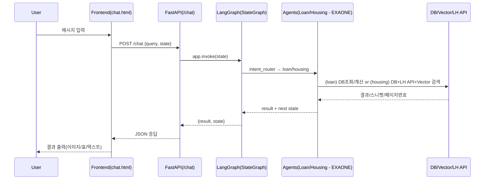

# 🏡 WELHOME: AI 기반 LH 청약·대출 추천 챗봇 (**Fine‑tuning + Agent + LangGraph**)

> **Fine‑tuning + Agent + LangGraph** 조합으로, LH 청약(임대)과 대출 상담을 **한 번의 대화 흐름**에서 처리하는 실무형 프로젝트입니다.  
> 에이전트 LLM(주택/대출)은 **EXAONE**, 용어/정책 Q&A는 **HyperCLOVAX‑SEED‑1.5B + LoRA**, 검색은 **Vector DB(Chroma)** 를 사용합니다.

---

## ✨ 핵심 가치 (Why this?)
- **Agent 지향 설계**: 역할이 분리된 에이전트가 **명시적 상태**로 협업하며 사용자 여정을 완결
- **LangGraph(StateGraph)**: 대화 분기/재시작/종료를 **그래프 구조**로 선언해 디버깅·테스트 용이
- **Fine‑tuning(LoRA)**: 정책·용어 중심 Q&A의 응답 일관성과 정확도를 강화
- **RAG(Vector DB)**: 공고 PDF **근거 스니펫**을 주입해 신뢰 가능한 답변 제공
- **단일 엔드포인트**: `/chat` 하나로 Intent→Agent 분기부터 PDF 페이지 이미지 내비까지 처리

---

## 🚀 주요 기능
- **Intent Router**: 입력을 `housing(청약)` / `loan(대출)` 로 자동 분류 (한 단어 응답 유도)
- **Housing Agent (EXAONE)**: 자격 수집 → **임대유형 추천** → **LH 공고 필터** → 선택 공고 **RAG Q&A**
- **Loan Agent (EXAONE)**: 금액/기간 입력 → SQLite 조회 → 상환유형별 **총 상환비용** 표/요약
- **PDF 페이지 네비게이션**: “페이지 **N**” 입력 시 `static/{PAN_ID}.pdf` **N쪽 PNG** 렌더
- **별도 Q&A**: `/qna` 는 **HyperCLOVAX + LoRA** 기반 **용어/정책** 질의응답

> **요구사항 반영 — 임대 조건 UX**: 주택 추천 후 **공고 선택** → 사용자가 *“임대 조건(보증금/임대료/자격…)?“* 을 물으면  
> **텍스트 응답 + 해당 내용이 실린 PDF 페이지 이미지**를 **동시에** 제공 (페이지 이동 버튼·“페이지 N” 점프 포함).

---

## 📊 아키텍처 다이어그램
```mermaid
flowchart TD
    A[사용자 입력] --> B[Intent Router]
    B -->|주택| C[Housing Agent(EXAONE) → SQLite DB + LH API + RAG(Chroma)]
    B -->|대출| D[Loan Agent(EXAONE) → SQLite DB + 상환액 계산]
    A -->|용어·정책 Q&A| E[Fine‑tuned Model (HyperCLOVAX + LoRA)]
    C --> F[응답 생성(HTML/Markdown)]
    D --> F
    E --> F
    F --> G[프론트엔드 UI 출력 (chat.html/qna.html)]
```

### 요청–응답 시퀀스(요약)


---

## 🧭 LangGraph 설계 (요지)
- **노드**: `intent_router`, `loan_agent`, `housing_agent`
- **엣지**: `intent_router → {loan_agent | housing_agent}` (조건부), 각 에이전트는 `"new"` 입력 시 **자기 재호출**, 그 외 **END**
- **State 예시**
  - 공통: `query`, `intent`, `result`
  - 대출: `loan_amount`, `loan_year`, `loan_table_text`, `loan_history` …
  - 주택: `housing_user_data`, `housing_history`, `housing_notices`, `notice_id`, `pages`, `current_page` …

---

## 📂 프로젝트 구조
```
WELHOME/
├── agents/                 # 에이전트 (EXAONE 기반)
│   ├── housing_agent.py
│   ├── loan_agent.py
│   └── intent_router.py
├── api/
│   └── lh_api.py           # LH 오픈 API
├── fine/
│   ├── fine_tuning.py      # LoRA 학습
│   ├── model.py            # 병합/추론 유틸
│   ├── naver.py            # merge_and_unload
│   └── fine_data.json      # 도메인 데이터
├── graph/
│   └── main_graph.py       # LangGraph(StateGraph)
├── utils/
│   ├── db_access.py        # SQLite 질의
│   ├── loan_calculator.py  # 총상환비용 계산/표
│   ├── query_builder.py    # WHERE 빌더
│   ├── region_map.py       # 지역코드 매핑
│   └── vectordb_search.py  # Chroma 검색
├── templates/              # UI
│   ├── index.html          # 랜딩/FAQ
│   ├── chat.html           # 상담 UI(+PDF 네비)
│   └── qna.html            # LoRA Q&A
├── scss/
│   ├── style.scss
│   ├── _common.scss
│   └── _reset.scss
├── static/                 # PNG/PDF 등 정적자원
│   └── pages/              # PDF→PNG 결과(페이지별)
├── main.py                 # FastAPI 진입점
└── README.md
```

---

## ⚙️ 실행 방법
### 1) 사전 준비
- **Python 3.10+**, (권장) CUDA 가능 환경
- **Poppler** 설치(pdf → png 변환) — macOS: `brew install poppler`, Ubuntu: `apt-get install -y poppler-utils`
- **Ollama** 설치 (에이전트 LLM: `exaone3.5:7.8b` 권장)
- **SQLite/Chroma** 경로 및 `static/{PAN_ID}.pdf` 배치

### 2) 의존성
```bash
pip install fastapi uvicorn jinja2 pydantic httpx pdf2image             transformers peft datasets chromadb             langchain-core langchain-community langchain-ollama markdown
```

### 3) 환경 변수 (.env 예시)
```dotenv
# 에이전트 LLM (EXAONE via Ollama)
OLLAMA_HOST=http://localhost:11434
AGENT_MODEL=exaone3.5:7.8b

# Q&A 모델 (HyperCLOVAX + LoRA)
BASE_MODEL=naver-hyperclovax/HyperCLOVAX-SEED-Text-Instruct-1.5B
LORA_ADAPTER=/home/alpaco/test/fine/finetuned_hyperclovax30

# DB/Vector
LOAN_DB=/home/alpaco/lyj0622/project_real/data/loan_type.db
HOUSING_DB=/home/alpaco/lyj0622/project_real/data/housing_type.db
CHROMA_DIR=/home/alpaco/lyj0622/chromaDB

# LH API
LH_SERVICE_KEY=***

# 서버
PORT=8111
```

### 4) 실행
```bash
uvicorn main:app --reload --port ${PORT:-8111}
# 또는
python main.py
```

- 브라우저 진입: `GET /`(랜딩), `GET /chat`(상담 UI), `GET/POST /qna`(LoRA Q&A)

---

## 🧠 RAG 파이프라인 (요약)
1) **Ingestion**: 공고 PDF → 텍스트 → 문단 분할 → 임베딩 → Chroma 업서트(`notice_id` 기준)  
2) **Retrieval**: 선택 `notice_id` 로 필터 + Top‑K 유사도 검색  
3) **Augmentation**: 스니펫을 프롬프트에 주입 → **근거 기반** 답변  
4) **Grounding UX**: 스니펫의 **페이지 번호**를 함께 반환 → 페이지 이미지를 자동 표시

---

## 🧪 API 명세 (요약)
### `POST /chat` — 상태 기반 상담
- 요청(JSON)
```json
{ "query": "임대 조건 알려줘", "state": { "intent": "housing", "notice_id": "PAN1234" } }
```
- 응답(JSON)
```json
{
  "result": "<임대 조건 요약 텍스트/HTML>",
  "state": { "intent": "housing", "notice_id": "PAN1234", "current_page": 7, "pages": [6,7,8] }
}
```
- `"current_page"` 가 있으면 **해당 페이지 이미지 자동 렌더**

### `GET/POST /qna` — Fine‑tuning Q&A
- 정책/용어 중심 질의응답(정적 지식)
- 예시 파라미터: `temperature=0.7`, `repetition_penalty=1.1~1.2`, `max_new_tokens=256`

---

## 🔐 보안·운영
- **비밀키/경로 외부화**: `.env` + Secret Manager
- **DB 경로 일관성**: 코드 상 하드코딩 제거, 환경변수로 단일화
- **입력 검증**: 금액·기간·불리언·페이지 번호 파싱 가드
- **리소스 통제**: PDF 경로 화이트리스트, 정적 파일 권한
- **관측성**: intent 결정, DB/LH API, Vector Top‑K, PDF 변환 로그
- **성능**: LangGraph 호출 최소화, Top‑K/MMR 튜닝, 캐싱/큐 분리

---

## 🧰 테스트 전략
- **유닛**: 금액/기간 파서, 총상환비용 계산, SQL WHERE 빌더, 지역코드 매핑
- **통합**: `/chat` (loan/housing) 플로우, `/qna` 안정성
- **E2E**: “조건 입력 → 공고 선택 → 임대 조건 질의(+페이지) → Q&A”

---

## 🧭 Hotkeys & Multiple Choices
**핫키**
- `w`: 진행 / `ww`: 강하게 진행(신속)
- `s`: 중지 / `ss`: 강하게 중지(즉시)
- `a` or `d`: 방향 전환(요약↔상세, 주택↔대출 등)

**멀티초이스 (메시지에 숫자 입력)**
1. 지금은 **주택 추천**부터 진행할까요, **대출 계산**부터 할까요?
2. 주택: **자격 검토** → **공고 추천** → **임대 조건 Q&A** 중 어디부터?
3. 대출 상환유형: **만기일시 / 원리금분할 / 원금분할** 중 선택
4. RAG 검색 Top‑K: **1 / 3 / 5** 중 선택 (정확↔포괄)
5. PDF 탐색: “페이지 **N**”으로 원하는 쪽을 바로 보시겠어요?

> 예: `w 2` → 2번 선택 후 진행, `a 3` → 3번으로 방향 전환, `ss` → 즉시 중지

---

## 🏁 라이선스
- 조직/프로젝트 정책에 따릅니다.
