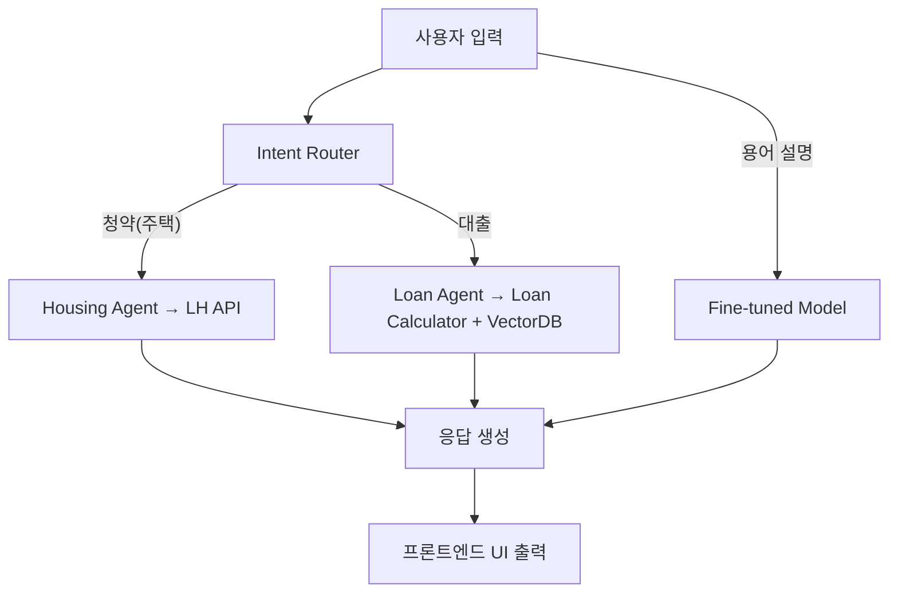

# 🏡 WELHOME: AI 기반 LH 청약·대출 추천 챗봇

WELHOME은 **공공주택 청약 제도**와 **주택담보·전세자금 대출 상품**을 쉽게 탐색하고 이해할 수 있도록 설계된 **AI 기반 실무형 프로젝트**입니다.  
사용자가 복잡한 정책 문서나 금융 정보를 직접 해석하지 않아도, **자연어 질의만으로 맞춤형 정보를 제공**받을 수 있습니다.

---

## 🚀 프로젝트 주요 특징

- **LLM 기반 다중 에이전트 구조**
  - `Intent Router`: 사용자의 질문을 `청약`, `대출`, `용어 설명` 등으로 자동 분류
  - `Housing Agent`: LH 청약 제도 및 조건 검색
  - `Loan Agent`: 주택담보/전세대출 상품 추천 및 조건 비교

- **LangChain + LangGraph 기반 워크플로우**
  - `main_graph.py`: 전체 에이전트의 실행 그래프 구성
  - 질의 흐름을 시각적으로 추적 및 디버깅 가능

- **파인튜닝 모델 적용**
  - `fine_tuning.py`: 청약 및 대출 FAQ 데이터로 LLM 파인튜닝
  - `fine_data.json`: 도메인 특화 질의응답 학습 데이터셋
  - `model.py`: 커스텀 모델 로더

- **실시간 API 연동**
  - `lh_api.py`: LH 오픈 API 연동 → 청약 정보 실시간 제공
  - `naver.py`: 네이버 API 연동 → 금융상품 및 뉴스 검색

- **백엔드·프론트엔드 통합**
  - **Backend**: FastAPI 기반 REST API
  - **Frontend**: `templates/` (HTML) + `scss/` (스타일링)
  - 실시간 채팅 UI (`chat.html`) 및 Q&A UI (`qna.html`) 제공

- **데이터 처리 및 검색**
  - `vectordb_search.py`: VectorDB 기반 의미검색 (유사 질문 빠른 탐색)
  - `query_builder.py`: SQL 쿼리 자동 생성
  - `db_access.py`: SQLite/MySQL 데이터 저장소 연동

---

## 📂 프로젝트 구조

```bash
WELHOME/
├── agents/              # 주요 에이전트 로직
│   ├── housing_agent.py
│   ├── loan_agent.py
│   └── intent_router.py
│
├── api/                 # 외부 API 연동
│   └── lh_api.py
│
├── fine/                # 파인튜닝 코드 및 데이터
│   ├── fine_tuning.py
│   ├── model.py
│   ├── naver.py
│   └── fine_data.json
│
├── graph/               # LangGraph 실행 흐름
│   └── main_graph.py
│
├── utils/               # 유틸리티 (DB, 검색, 계산기 등)
│   ├── db_access.py
│   ├── loan_calculator.py
│   ├── query_builder.py
│   ├── region_map.py
│   └── vectordb_search.py
│
├── templates/           # 프론트엔드 UI
│   ├── chat.html
│   ├── index.html
│   └── qna.html
│
├── scss/                # 스타일 시트
│   ├── style.scss
│   ├── _common.scss
│   └── _reset.scss
│
├── main.py              # FastAPI 실행 진입점
└── README.md
```

---

## 💡 기술 스택

- **AI/ML**: LangChain, LangGraph, HuggingFace, FAISS, SentenceTransformers
- **Backend**: FastAPI, SQLite/MySQL
- **Frontend**: HTML5, SCSS, JavaScript
- **Infra**: GitHub, REST API 연동 (LH, Naver)

---

## ⚙️ 실행 방법

### 1) 환경 설정
```bash
git clone https://github.com/ChangMin59/welhome.git
cd welhome
pip install -r requirements.txt
```

### 2) 환경 변수 (.env)
프로젝트 루트에 `.env` 파일을 생성하고 아래 값을 입력하세요.

```env
# 🔎 Tavily 검색 API
TAVILY_API_KEY=your_tavily_api_key

# 🌐 Naver API
NAVER_CLIENT_ID=your_naver_client_id
NAVER_CLIENT_SECRET=your_naver_client_secret
```

> ⚠️ `.env` 파일은 반드시 `.gitignore`에 포함시켜야 하며, GitHub에 업로드하면 안 됩니다.

### 3) 서버 실행
```bash
python main.py
```

FastAPI 서버가 실행되며, 브라우저에서 `http://localhost:8000` 접속 가능합니다.

---

## 📌 주요 활용 시나리오

1. **청약 조건 탐색**  
   - 사용자: *"내가 지금 신청할 수 있는 청약은 뭐야?"*  
   - `Housing Agent`가 LH API를 조회해 조건에 맞는 청약 추천

2. **대출 한도 계산**  
   - 사용자: *"연봉 4천에 전세 2억이면 대출 얼마까지 가능해?"*  
   - `Loan Agent`가 `loan_calculator.py`를 이용해 대출 한도 계산

3. **용어 설명**  
   - 사용자: *"주택도시기금이 뭐야?"*  
   - `Intent Router`가 용어 설명으로 분류 후, 파인튜닝 모델 응답 제공

---

## 📊 아키텍처 다이어그램



---

## 🏆 프로젝트 의의

- **실무형 데이터 파이프라인**: API + DB + VectorDB 통합  
- **도메인 특화 파인튜닝**: 공공주택 및 금융 영역 전문화  
- **사용자 중심 UI/UX**: 실시간 챗봇 및 Q&A 서비스 제공  

👉 본 프로젝트는 단순 학습용을 넘어, **실제 서비스 적용을 염두에 둔 프로덕션 수준**의 설계를 목표로 합니다.
