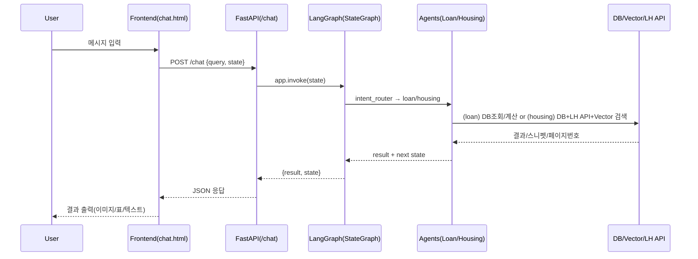

# 🏡 WELHOME: AI 기반 LH 청약·대출 추천 챗봇 (Fine‑tuning + Agent + LangGraph)

> **Intent Router + RAG + Fine‑tuning + LangGraph** 조합으로, LH 청약(임대) 및 대출 상담을 **하나의 대화 흐름**에서 처리하는 실무형 프로젝트입니다.  
> 백엔드는 **FastAPI**, 상담 LLM은 **EXAONE**, 정책·용어 Q&A는 **HyperCLOVAX + LoRA**, 검색은 **Vector DB(Chroma)** 를 사용합니다.

---

## ✨ 핵심 가치 (Why this?)

- **명시적 상태/흐름 관리**: **LangGraph(StateGraph)** 로 대화 플로우와 분기를 코드 레벨에서 투명화
- **도메인 적합성 확보**: **Fine‑tuning(LoRA)** 로 정책·용어 Q&A 품질 향상
- **근거 중심 답변**: **RAG(ChromaDB)** 로 공고 PDF 근거를 컨텍스트로 주입
- **단일 엔드포인트**: `/chat` 하나로 **Intent → Agent** 분기, PDF 페이지 네비게이션(이미지)까지 처리

---

## 🚀 주요 특징

- **LLM 기반 다중 에이전트 구조**
  - **Intent Router**: 사용자의 질문을 `housing(청약)` / `loan(대출)` *(+ 필요시 용어/정책 Q&A)* 로 자동 분류
  - **Housing Agent**: 자격 질의 플로우 → **임대주택 유형 추천** → **LH 공고** 필터 → 선택 공고 **RAG**
  - **Loan Agent**: 대출금액/기간 입력 → SQLite 조회 → 상환유형별 **총 상환비용** 표/요약

- **LangChain + LangGraph 워크플로우**
  - `graph/main_graph.py` 에서 노드(`intent_router`, `loan_agent`, `housing_agent`)와 조건부 엣지 정의
  - `"new"` 명령 루프, **END** 분기 등 플로우를 명시화 → 디버깅/테스트 용이

- **Fine‑tuning 모델 적용**
  - `fine/fine_tuning.py`: `{instruction, output}` 포맷으로 **HyperCLOVAX‑SEED‑1.5B** 를 LoRA로 학습
  - `fine/model.py | fine/naver.py`: LoRA 병합/추론 유틸(서비스에서는 `main.py` 내 추론 함수 사용)

- **실시간 API 연동 & PDF 내비**
  - `api/lh_api.py`: **LH 오픈 API** 연동(공고중 필터 등)
  - `/chat`: “페이지 **N**” 입력 시 `static/{PAN_ID}.pdf` 의 **N쪽 PNG** 생성·서빙

- **백엔드·프론트엔드 통합**
  - **Backend**: FastAPI + Jinja2 + StaticFiles
  - **Frontend**: `templates/` (HTML) + `scss/` (스타일)
  - 채팅 UI(`chat.html`), Q&A UI(`qna.html`) 포함

---

## 📂 프로젝트 구조

```bash
WELHOME/
├── agents/
│   ├── housing_agent.py        # 청약 상담 상태머신
│   ├── loan_agent.py           # 대출 상담 상태머신
│   └── intent_router.py        # Intent 분류(loan/housing)
│
├── api/
│   └── lh_api.py               # LH 오픈 API 래퍼
│
├── fine/
│   ├── fine_tuning.py          # LoRA 학습 스크립트
│   ├── model.py                # 병합/추론 유틸
│   ├── naver.py                # LoRA merge (merge_and_unload)
│   └── fine_data.json          # 도메인 학습 데이터
│
├── graph/
│   └── main_graph.py           # LangGraph(StateGraph) 정의
│
├── utils/
│   ├── db_access.py            # SQLite 질의(임대유형 등)
│   ├── loan_calculator.py      # 상환유형별 총비용 계산/표 생성
│   ├── query_builder.py        # SQL WHERE 구성 유틸
│   ├── region_map.py           # 지역명 → 지역코드 매핑
│   └── vectordb_search.py      # Vector DB(Chroma) 검색
│
├── templates/
│   ├── index.html              # 랜딩(FAQ/바로가기)
│   ├── chat.html               # 주택/대출 상담 UI(+PDF 페이지 내비)
│   └── qna.html                # Fine‑tuned Q&A UI
│
├── scss/
│   ├── style.scss
│   ├── _common.scss
│   └── _reset.scss
│
├── static/                     # 정적 리소스(아이콘, PNG, PDF 등)
│   └── pages/                  # PDF → PNG 변환 결과(페이지별)
│
├── main.py                     # FastAPI 진입점(/, /chat, /qna)
└── README.md
```

---

## 📊 아키텍처 다이어그램

```mermaid
flowchart TD
    A[사용자 입력] --> B[Intent Router]
    B -->|주택| C[Housing Agent → SQLite DB + LH API + RAG(Chroma)]
    B -->|대출| D[Loan Agent → SQLite DB + 상환액 계산]
    A -->|용어·정책 Q&A| E[Fine‑tuned Model (HyperCLOVAX + LoRA)]
    C --> F[응답 생성(HTML/Markdown)]
    D --> F
    E --> F
    F --> G[프론트엔드 UI 출력 (chat.html/qna.html)]
```

### 요청–응답 시퀀스(요약)



---

## 🧠 동작 개요

### Intent Router
- 사용자 입력을 `loan` / `housing` *(+ 선택적으로 용어/정책 Q&A)* 로 **한 단어** 분류

### Loan Agent
- 대출금액/기간 파싱 → SQLite 조회 → 상환유형(만기일시/원리금분할/원금분할) **총상환비용** 표/요약
- `new`/`exit` 제어, 진행 히스토리 유지

### Housing Agent — **공고 선택 후 “임대 조건” 질의 UX (요구사항 반영)**
1. **주택 추천** 완료 후, 사용자가 **특정 공고를 선택**합니다.  
2. 사용자가 *“임대 조건이 뭐야?”, “보증금/임대료 알려줘”* 등 **임대 조건 관련 질의**를 하면,
   - 백엔드는 선택된 `notice_id`로 **Vector DB(Chroma)** 를 **필터**하여 관련 스니펫을 우선 검색합니다.
   - **답변 텍스트**(보증금/월임대료/자격/공급유형 등)를 생성합니다.
   - 동시에, 스니펫이 속한 **PDF 페이지 번호**를 계산하여 `state.current_page` 로 설정합니다.
3. 프론트엔드(`chat.html`)는 응답 수신 시 `state.notice_id` & `state.current_page` 가 있으면
   - 해당 **페이지 이미지를 자동 렌더**합니다.  
   - **이전/다음** 버튼으로 페이지 이동 가능하며, “페이지 **N**” 입력으로 직접 점프도 가능합니다.

> 즉, **임대 조건 질의에 대한 텍스트 응답 + 해당 내용이 실린 PDF 페이지 이미지**를 **동시에** 제공합니다.

---

## 🔎 RAG 파이프라인(요약)

1) **Ingestion**: 공고 PDF → 텍스트 추출 → 문단 분할 → 임베딩 → Chroma 업서트(`notice_id` 기준)  
2) **Retrieval**: 선택 `notice_id` 로 필터 + Top‑K 유사도 검색  
3) **Augmentation**: 스니펫을 프롬프트에 주입 → **근거 기반** 응답  
4) **Grounding UX**: 스니펫의 **페이지 번호**를 함께 반환 → 페이지 이미지를 자동 표시

---

## 🧪 API 명세(요약)

### `POST /chat` — 상태 기반 상담
- **요청(JSON)**
```json
{ "query": "임대 조건 알려줘", "state": { "intent": "housing", "notice_id": "PAN1234" } }
```
- **응답(JSON)**
```json
{
  "result": "<임대 조건 요약 텍스트/HTML>",
  "state": {
    "intent": "housing",
    "notice_id": "PAN1234",
    "current_page": 7,
    "pages": [6,7,8]
  }
}
```
- `"current_page"` 가 포함되면 프론트엔드가 해당 **페이지 이미지를 자동 렌더**합니다.

### `GET/POST /qna` — Fine‑tuning Q&A
- 정책/용어 중심, **정적 지식 질의응답**에 강점
- 추론 파라미터(예): `temperature=0.7`, `repetition_penalty=1.1~1.2`, `max_new_tokens=256`

---

## ⚙️ 실행 방법

### 1) 사전 준비
- **Python 3.10+**, (권장) CUDA 가능 환경
- **Poppler** 설치(pdf → png 변환용)  
  - macOS: `brew install poppler`  
  - Ubuntu: `apt-get install -y poppler-utils`
- **Ollama** 설치(상담 LLM: `exaone3.5:7.8b` 권장)
- **SQLite/Chroma** 경로 및 `static/{PAN_ID}.pdf` 배치

### 2) 의존성
```bash
pip install fastapi uvicorn jinja2 pydantic httpx pdf2image             transformers peft datasets chromadb             langchain-core langchain-community langchain-ollama markdown
```

### 3) 환경 변수(.env 예시)
```dotenv
# 모델/경로
OLLAMA_HOST=http://localhost:11434
BASE_MODEL=naver-hyperclovax/HyperCLOVAX-SEED-Text-Instruct-1.5B
LORA_ADAPTER=/home/alpaco/test/fine/finetuned_hyperclovax30

# DB/Vector
LOAN_DB=/home/alpaco/lyj0622/project_real/data/loan_type.db
HOUSING_DB=/home/alpaco/lyj0622/project_real/data/housing_type.db
CHROMA_DIR=/home/alpaco/lyj0622/chromaDB

# LH API
LH_SERVICE_KEY=***

# 서버
PORT=8111
```

### 4) 서버 실행
```bash
uvicorn main:app --reload --port ${PORT:-8111}
# 또는
python main.py
```

- 브라우저 진입:
  - `GET /` → 랜딩(index.html)
  - `GET /chat` → 주택/대출 상담 UI
  - `GET/POST /qna` → Fine‑tuned Q&A

---

## 🔐 보안·운영 체크리스트

- [ ] **비밀키/경로 외부화**: `.env` + Secret Manager(배포 환경)
- [ ] **DB 경로 일관성**: 코드 상 DB 경로를 **환경변수 단일화**
- [ ] **입력 검증/정규화**: 금액/기간/불리언/페이지 숫자 등 파싱 가드
- [ ] **리소스 접근 통제**: PDF 경로 화이트리스트, 정적 리소스 권한
- [ ] **관측성**: intent 결정, DB/LH API 결과, Vector Top‑K, PDF 변환 로그
- [ ] **성능**: LangGraph 호출 최소화, Top‑K/MMR 튜닝, 캐시/큐 분리

---

## 🧰 테스트 전략

- **유닛**: 금액/기간 파서, 총상환비용 계산, SQL WHERE 빌더, 지역코드 매핑
- **통합**: `/chat` (loan/housing) 플로우, `/qna` 안정성
- **E2E**: “조건 입력 → 공고 선택 → 임대 조건 질의 → 페이지 내비 → Q&A”

---

## 🎛 Hotkeys & Choices (대화 제어)

- **w**: 진행 / **ww**: 강하게 진행(신속)
- **s**: 중지 / **ss**: 강하게 중지(즉시)
- **a / d**: 방향 전환(요약↔상세, 주택↔대출 등)

### 다음 단계(선택지)
1) **프로덕션 체크리스트**(보안/성능/관측성) 문서화  
2) **RAG 인덱싱 파이프라인**(PDF→텍스트→임베딩) 스크립트 추가  
3) **테스트 시나리오**(pytest) 샘플 제공  
4) **프롬프트 가이드라인**(의도/톤/포맷) 문서화  
5) **모델 파라미터 프리셋**(정확/요약/창의) 제공

> 예) `w 2` → 2번 빠르게 진행, `a 3` → 3번으로 방향 전환, `ss` → 즉시 중지
